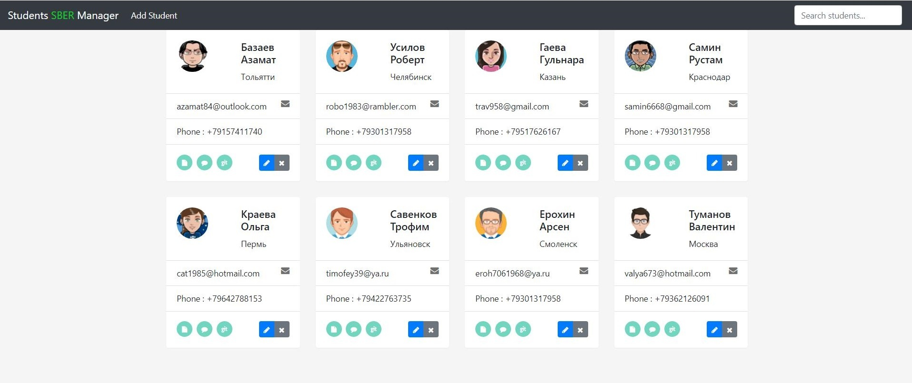

# STUDENTS MANAGER

<a href="https://students-manager-webapp.herokuapp.com" target="_blank">Попробовать приложение</a> 

 

------------
## RESTful приложение написанное с помощью <a href="https://angular.io" target="_blank">Angular 12</a> и <a href="https://spring.io" target="_blank">Spring</a>.

### Описание:

Приложение создает базу студентов, где вы можете:
- добавлять новых студентов
- редактировать текущих
- удалять студентов
- выполнять быстрый просмотр профиля студента
- перейти на git проектов студента
- добавлять и удалять заметки к студенту 
- производить быстрый поиск студентов по различным полям

------------

### Информация:

#### Использованные Технологии:

**_Frontend_**:&nbsp; Angular, Typescript, JS, Bootstrap, Html/Css, Responsive Design 
**_Backend_**:&nbsp; Java, Spring-Core, Spring-MVC, Spring-Boot, Spring-Data, Maven 
**_Database_**:&nbsp; PostgreSQL 
**_Deployment_**:&nbsp; <a href="https://www.heroku.com/" target="_blank">Heroku</a>  
<a href="http://studentsmanager-app.herokuapp.com" target="_blank">http://studentsmanager-app.herokuapp.com</a>  - деплой бэкенда. Можно использовать для теста APIs. 

#### APIs:

api                        |Action:
---------------------------|------------------------------
/students                  |**GET**&nbsp; All students
/students/:studentId       |**GET**&nbsp; Student by ID
/students                  |**POST**&nbsp; New student
/students/:studentId       |**PUT**&nbsp; Student
/students/:studentId       |**DELETE**&nbsp; Student
/notes/student/:studentId  |**GET**&nbsp; All notes of student
/notes/:noteId             |**GET**&nbsp; Note by ID
/notes                     |**POST**&nbsp; New note
/notes/:noteId             |**PUT**&nbsp; Note
/notes/:noteId             |**DELETE** Note

------------

### Репозиторий:
_/sm-frontend_ &nbsp;- &nbsp;фронтенд код приложения 
_/sm-backend_ &nbsp;- &nbsp;бэкенд код приложения 
_/avatars_ - &nbsp;- &nbsp;папка с аватарками для примера 
_/dbs_ - &nbsp;- &nbsp;папка с бд с хероку для примера 
_README-rus.md_ - &nbsp;- &nbsp;ридми на русском языке

------------