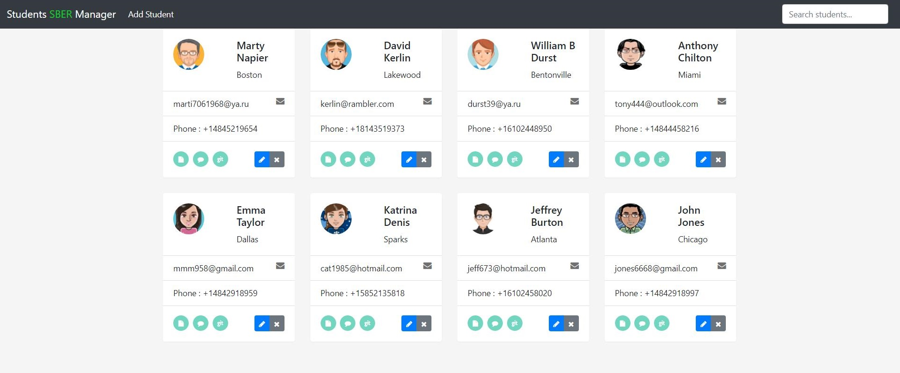

# STUDENTS MANAGER

## **<a href="https://students-manager-webapp.herokuapp.com" target="_blank">**Try app**</a> **
(If the database has not loaded then refresh the page several times, this is due to the work of Heroku hosting) 

 

------------
## RESTful app coded with <a href="https://angular.io" target="_blank">Angular 12</a> and <a href="https://spring.io" target="_blank">Spring</a>.

### Description:

The app creates a database of students where you can:
- add new students
- edit current students
- delete students
- perform a quick view of a student's profile
- go to the student's git projects
- add and delete notes for a student 
- quickly search for students by various fields

------------

### Information:

#### Tech stack:

**_Frontend_**:&nbsp; Angular, Typescript, JS, Bootstrap, Html/Css, Responsive Design 
**_Backend_**:&nbsp; Java, Spring-Core, Spring-MVC, Spring-Boot, Spring-Data, Maven 
**_Database_**:&nbsp; PostgreSQL 
**_Deployment_**:&nbsp; <a href="https://www.heroku.com/" target="_blank">Heroku</a>  
<a href="http://studentsmanager-app.herokuapp.com" target="_blank">http://studentsmanager-app.herokuapp.com</a>  - backend deployment. You can use it to test APIs. 

#### APIs:

api                        |Action:
---------------------------|------------------------------
/students                  |**GET**&nbsp; All students
/students/:studentId       |**GET**&nbsp; Student by ID
/students                  |**POST**&nbsp; New student
/students/:studentId       |**PUT**&nbsp; Student
/students/:studentId       |**DELETE**&nbsp; Student
/notes/student/:studentId  |**GET**&nbsp; All notes of student
/notes/:noteId             |**GET**&nbsp; Note by ID
/notes                     |**POST**&nbsp; New note
/notes/:noteId             |**PUT**&nbsp; Note
/notes/:noteId             |**DELETE** Note

------------

### Репозиторий:
_/sm-frontend_ &nbsp;- &nbsp;app frontend code 
_/sm-backend_ &nbsp;- &nbsp;app backend code 
_/avatars_ &nbsp;- &nbsp;avatar folder as an example 
_/dbs_ &nbsp;- &nbsp;heroku db folder as an example. <a href="https://devcenter.heroku.com/articles/heroku-postgres-import-export" target="_blank">How to import the base into heroku</a> 
_README-rus.md_ &nbsp;- &nbsp;readme in Russian 
_README.md_ &nbsp;- &nbsp;readme in English

------------